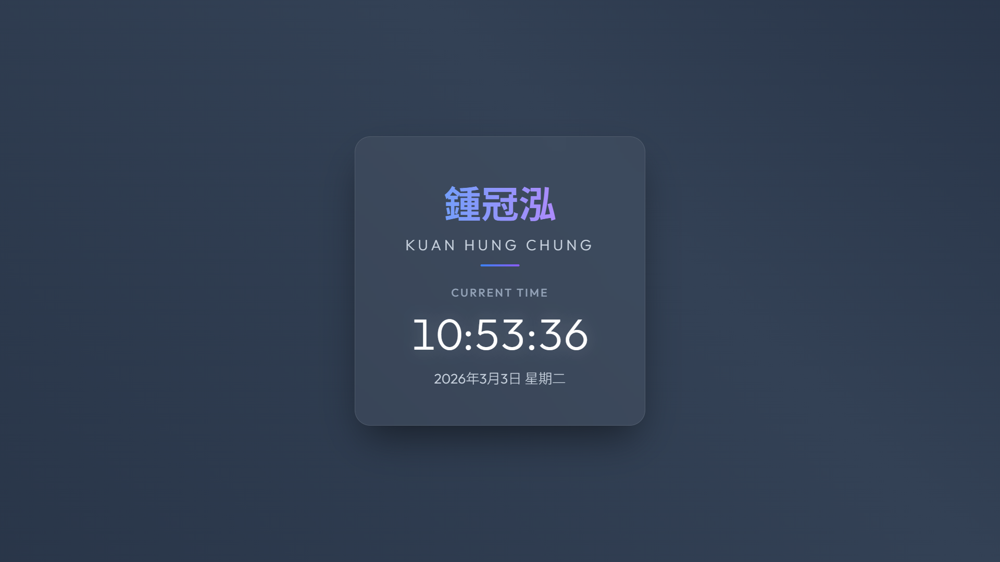

# 114-2 智慧物聯網應用與實作 - 網頁開發基礎 (AIoT DIY 1)

**個人資訊與動態時間展示網頁 (Personal Info & Dynamic Time Webpage)**



🔗 **Live Demo:** [https://chungkuanhung.github.io/aiot_diy1/](https://chungkuanhung.github.io/aiot_diy1/)

---

## 📝 本次計畫做了什麼事？ (Project Objectives)

本次計畫為「智慧物聯網應用與實作」課程的第一次動手做任務 (DIY 1)，主要目標是：
1. **環境建置**：安裝並熟悉 Google 推出之「Anti Gravity」AI IDE 工具。
2. **網頁實作**：運用 AI Agent 輔助，開發一個單頁式靜態網頁 (Single-page Web Application)。
3. **功能需求**：網頁中明確展示了我的**中文與英文姓名**，以及透過 JavaScript 即時抓取系統的**動態現在時間與日期**。
4. **版本控制與部署**：學習建立 GitHub Repository，將專案原始碼推送至遠端，並使用 **GitHub Pages** 服務將網頁部署上線，產生可對外展示的 Live Demo 連結。

## 🛠️ 如何做到的？ (Implementation Details)

這個專案是透過與 AI Agent (Anti Gravity) 協作並運用純前端技術完成的，實作細節如下：

1. **AI 協同開發 (Bot Interaction)**：
    * 透過下達清晰的中文/英文 Prompt（指令），請 AI Agent 幫忙建立 HTML 骨架、撰寫 CSS 樣式與設計 JavaScript 邏輯。
    * 要求 AI 採用現代化的 **Glassmorphism (玻璃擬物化)** 風格與全螢幕動態漸層背景，跳脫傳統陽春範本。
    
2. **技術堆疊 (Tech Stack)**：
    * **HTML5**：定義網頁結構與各區塊語意。
    * **CSS3**：負責視覺排版、動態背景特效 (`@keyframes`)，並運用 `@media queries` 實作 **Responsive Web Design (RWD 響應式裝置設計)**，讓網頁在手機、平板與電腦螢幕上都能有最佳的閱讀體驗。
    * **JavaScript (Vanilla JS)**：負責操作 DOM 物件，使用 `new Date()` 讀取當下時間，並配合 `setInterval` 達成每秒自動重新渲染時間的功能。

3. **部屬流程 (Deployment)**：
    * 透過終端機 (Terminal) 執行 `git init`, `git add`, `git commit` 將程式碼版控。
    * 執行 `git push` 推送至 `github.com/chungkuanhung/aiot_diy1`。
    * 在 GitHub Repo Settings 中開啟 **GitHub Pages**，指定由 `main` 分支進行發布。

## 📂 檔案結構 (Project Structure)

```text
aiot_diy1/
├── index.html          # 主程式：包含 HTML 結構、CSS 樣式與 JS 邏輯
├── README.md           # 專案說明文件檔 (即本文件)
├── ai_conversation.md  # 🤖 AI Agent 協同開發對話完整紀錄
└── screenshot.png      # 網頁成品截圖 (請自行上傳替換)
```
